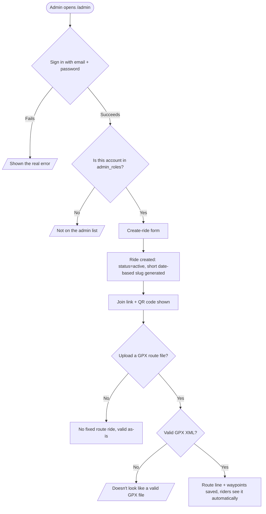
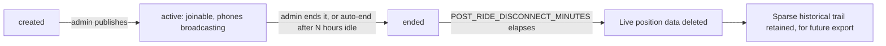
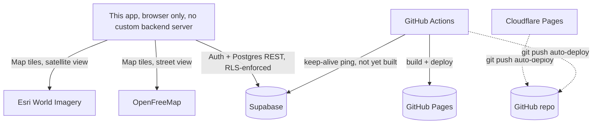

# Design flow

Required Phase 6 deliverable (see `workingTitle-BUILD-PROMPT.md`'s "Design
flow documentation" section): the full app workflow and every real branch
point, in Mermaid so it renders automatically on GitHub with no extra
tooling, consistent with this project's $0-forever rule.

## Rider join flow: link/QR to live map

```mermaid
flowchart TD
    Start([Rider opens a ride's join link or scans its QR code]) --> Lookup{Does the short slug match a real ride?}
    Lookup -->|No| NotFound[/Shown: "this ride link doesn't match any real ride"/]
    Lookup -->|Yes| Choice{"I'm riding" or "Just watching"?}

    Choice -->|Just watching| Spectator[Joined as spectator, no location ever requested]
    Choice -->|I'm riding| Permission{Browser location permission}

    Permission -->|Granted| Rider[Joined as rider, sharing live location]
    Permission -->|Denied / unavailable / timeout| Help[/Device-specific recovery instructions shown/]
    Help --> Retry{Retry location share}
    Retry -->|Granted| Rider
    Retry -->|Still fails / chooses "just watch"| Spectator

    Rider --> WakeLock[Screen wake lock requested]
    Rider --> Poll[Polling loop starts: POST own position + GET everyone's]
    Spectator --> PollWatch[Polling loop starts: GET everyone's positions only]

    Poll --> MapDraw[Map redraws: clustering, signal-color dots, route line/waypoints]
    PollWatch --> MapDraw
    MapDraw --> Roster[Roster panel available, same poll data, sorted by status]
```

## Admin ride creation flow



## Ride lifecycle and data retention



## Where each external service gets called


